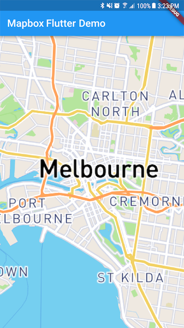

# Flutter Mapbox GL

> **Please note that this project is community driven and is not an official Mapbox product.** We welcome [feedback](https://github.com/tobrun/flutter-mapbox-gl/issues) and contributions.

This Flutter plugin allows to show embedded interactive and customizable vector maps inside a Flutter widget. For the Android and iOS integration, we use [mapbox-gl-native](https://github.com/mapbox/mapbox-gl-native). For web, we rely on [mapbox-gl-js](https://github.com/mapbox/mapbox-gl-js). This project only supports a subset of the API exposed by these libraries. 



## Running the example app

- Install [Flutter](https://flutter.io/get-started/) and validate its installation with `flutter doctor`
- Clone the repository with `git clone git@github.com:tobrun/flutter-mapbox-gl.git`
- Get a public Mapbox access token (see next section)
- Add a secret Mapbox access token for downloading the SDK
- Connect a mobile device or start an emulator, simulator or chrome
- Locate the id of a the device with `flutter devices`
- Run the app with `cd flutter_mapbox/example && flutter packages get && flutter run -d {device_id} --dart-define=ACCESS_TOKEN=ADD_YOUR_TOKEN_HERE`

## Adding a Mapbox Access Token

This project uses Mapbox vector tiles, which requires a Mapbox account and a Mapbox access token. Obtain a free access token on [your Mapbox account page](https://www.mapbox.com/account/access-tokens/).
> **Even if you do not use Mapbox vector tiles but vector tiles from a different source (like self-hosted tiles) with this plugin, you will need to specify any non-empty string as Access Token as explained below!**


The **recommended** way to provide your access token is through the `MapboxMap` constructor's `accessToken` parameter, which is available starting from the v0.8 release. Note that you should always use the same token throughout your entire app.

An alternative method to provide access tokens that was required until the v0.7 release is described in [this wiki article](https://github.com/tobrun/flutter-mapbox-gl/wiki/Mapbox-access-tokens).

### SDK Download token

You must also configure a secret access token having the *Download: read* scope for
[Android](https://docs.mapbox.com/android/maps/guides/install/) and/or 
[iOS](https://docs.mapbox.com/ios/maps/guides/install/).

If this configuration is not present, an error like the following appears during 
the build process:

#### Android
```
* What went wrong:
A problem occurred evaluating project ':mapbox_gl'.
> SDK Registry token is null. See README.md for more information.
```

#### iOS
```
[!] Error installing Mapbox-iOS-SDK
curl: (22) The requested URL returned error: 401 Unauthorized
```


## Avoid Android UnsatisfiedLinkError

Update buildTypes in `android\app\build.gradle`

```gradle
buildTypes {
    release {
        // other configs
        ndk {
            abiFilters 'armeabi-v7a','arm64-v8a','x86_64', 'x86'
        }
    }
}
```

## Using the SDK in your project

This project is available on [pub.dev](https://pub.dev/packages/mapbox_gl), follow the [instructions](https://flutter.dev/docs/development/packages-and-plugins/using-packages#adding-a-package-dependency-to-an-app) to integrate a package into your flutter application. For platform specific integration, use the flutter application under the example folder as reference. 

## Supported API

| Feature | Android | iOS | Web |
| ------ | ------ | ----- | ----- |
| Style | :white_check_mark:   | :white_check_mark: | :white_check_mark: |
| Camera | :white_check_mark:   | :white_check_mark: | :white_check_mark: |
| Gesture | :white_check_mark:   | :white_check_mark: | :white_check_mark: |
| User Location | :white_check_mark: | :white_check_mark: | :white_check_mark: |
| Symbol | :white_check_mark:   | :white_check_mark: | :white_check_mark: |
| Circle | :white_check_mark:   | :white_check_mark: | :white_check_mark: |
| Line | :white_check_mark:   | :white_check_mark: | :white_check_mark: |
| Fill | :white_check_mark:   | :white_check_mark: | :white_check_mark: |

## Map Styles

Map styles can be supplied by setting the `styleString` in the `MapOptions`. The following formats are supported:

1. Passing the URL of the map style. This can be one of the built-in map styles, also see `MapboxStyles` or a custom map style served remotely using a URL that start with 'http(s)://' or 'mapbox://'
2. Passing the style as a local asset. Create a JSON file in the `assets` and add a reference in `pubspec.yml`. Set the style string to the relative path for this asset in order to load it into the map.
3. Passing the style as a local file. create an JSON file in app directory (e.g. ApplicationDocumentsDirectory). Set the style string to the absolute path of this JSON file.
4. Passing the raw JSON of the map style. This is only supported on Android.  

## Offline Sideloading

Support for offline maps is available by *"side loading"* the required map tiles and including them in your `assets` folder.

* Create your tiles package by following the guide available [here](https://docs.mapbox.com/ios/maps/overview/offline/).

* Place the tiles.db file generated in step one in your assets directory and add a reference to it in your `pubspec.yml` file.

```
   assets:
     - assets/cache.db
```

* Call `installOfflineMapTiles` when your application starts to copy your tiles into the location where Mapbox can access them.  **NOTE:** This method should be called **before** the Map widget is loaded to prevent collisions when copying the files into place.
 
```
    try {
      await installOfflineMapTiles(join("assets", "cache.db"));
    } catch (err) {
      print(err);
    }
```

## Downloading Offline Regions

An offline region is a defined region of a map that is available for use in conditions with limited or no network connection. Tiles for selected region, style and precision are downloaded from Mapbox using proper SDK methods and stored in application's cache. 

* Beware of selecting big regions, as size might be significant. Here is an online estimator https://docs.mapbox.com/playground/offline-estimator/.

* Call `downloadOfflineRegionStream` with predefined `OfflineRegion` and optionally track progress in the callback function.

```      
    final Function(DownloadRegionStatus event) onEvent = (DownloadRegionStatus status) {
      if (status.runtimeType == Success) {
        // ...
      } else if (status.runtimeType == InProgress) {
        int progress = (status as InProgress).progress.round();
        // ...
      } else if (status.runtimeType == Error) {
        // ...
      }
    };

    final OfflineRegion offlineRegion = OfflineRegion(
      bounds: LatLngBounds(
        northeast: LatLng(52.5050648, 13.3915634),
        southwest: LatLng(52.4943073, 13.4055383),
      ),
      id: 1,
      minZoom: 6,
      maxZoom: 18,
      mapStyleUrl: 'mapbox://styles/mapbox/streets-v11',
    );

    downloadOfflineRegionStream(offlineRegion, onEvent);
```


## Location features
### Android
Add the `ACCESS_COARSE_LOCATION` or `ACCESS_FINE_LOCATION` permission in the application manifest `android/app/src/main/AndroidManifest.xml` to enable location features in an **Android** application:
```
<manifest ...
    <uses-permission android:name="android.permission.ACCESS_FINE_LOCATION" />
    <uses-permission android:name="android.permission.ACCESS_COARSE_LOCATION" />
```

Starting from Android API level 23 you also need to request it at runtime. This plugin does not handle this for you. The example app uses the flutter ['location' plugin](https://pub.dev/packages/location) for this.

### iOS
To enable location features in an **iOS** application:

If you access your users' location, you should also add the following key to `ios/Runner/Info.plist` to explain why you need access to their location data:

```
xml ...
    <key>NSLocationWhenInUseUsageDescription</key>
    <string>[Your explanation here]</string>
```

Mapbox [recommends](https://docs.mapbox.com/help/tutorials/first-steps-ios-sdk/#display-the-users-location) the explanation "Shows your location on the map and helps improve the map".

## Documentation

This README file currently houses all of the documentation for this Flutter project. Please visit [mapbox.com/android-docs](https://www.mapbox.com/android-docs/) if you'd like more information about the Mapbox Maps SDK for Android and [mapbox.com/ios-sdk](https://www.mapbox.com/ios-sdk/) for more information about the Mapbox Maps SDK for iOS.

## Getting Help

- **Need help with your code?**: Look for previous questions on the [#mapbox tag](https://stackoverflow.com/questions/tagged/mapbox+flutter) — or [ask a new question](https://stackoverflow.com/questions/tagged/mapbox+android).
- **Have a bug to report?** [Open an issue](https://github.com/tobrun/flutter-mapbox-gl/issues/new). If possible, include a full log and information which shows the issue.
- **Have a feature request?** [Open an issue](https://github.com/tobrun/flutter-mapbox-gl/issues/new). Tell us what the feature should do and why you want the feature.


## Contributing

We welcome contributions to this repository! If you're interested in helping build this Mapbox/Flutter integration, please read [the contribution guide](https://github.com/tobrun/flutter-mapbox-gl/blob/master/CONTRIBUTING.md) to learn how to get started.
