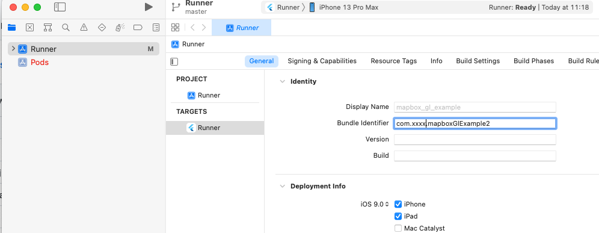
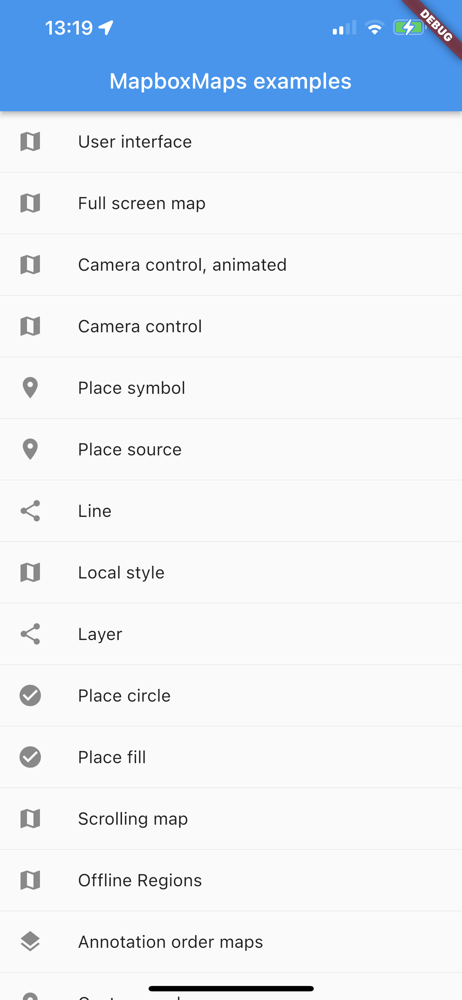

# Running the example code

- You'll find the example code in the `example` folder of this repository

## Secret Mapbox access token

A secret access token with the `Downloads: Read` scope is required for the underlying Mapbox SDKs to be downloaded.
Information on setting it up is available in the Mapbox documentation:
[Android](https://docs.mapbox.com/android/maps/guides/install/),
[iOS](https://docs.mapbox.com/ios/maps/guides/install/).

If the properly configured token is not present,
the build process fails with one the following errors *(for Android/iOS respectively)*:

```
* What went wrong:
A problem occurred evaluating project ':mapbox_gl'.
> SDK Registry token is null. See README.md for more information.
```

```
[!] Error installing Mapbox-iOS-SDK
curl: (22) The requested URL returned error: 401 Unauthorized
```

## iOS
- Clone this repo
- Open `example/ios/Runner.xcworkspace` in XCode
- On the left, select Runner and change the Bundle identifier on the `general` tab to something of your own.



- On the `signing & capabilities` tab change the team to your own.
- Close Xcode
- run `flutter build ios --dart-define ACCESS_TOKEN=sk.xxxxxxxxxxxxxxxxxxxxx` to make sure the project builds from the command line. The `ACCESS_TOKEN` is the Mapbox token you've obtained in the `Secret Mapbox access token` step described above.
- The build command output should be something like:

```terminal
Warning: You are using these overridden dependencies:
! mapbox_gl_platform_interface 0.15.0 from path ../mapbox_gl_platform_interface
! mapbox_gl_web 0.15.0 from path ../mapbox_gl_web
Running "flutter pub get" in example...                          1,918ms
Building com.xxx.mapboxtest for device (ios-release)...
Updating project for Xcode compatibility.
Upgrading project.pbxproj
Upgrading Runner.xcscheme
Signing iOS app for device deployment using developer identity: "Apple Development: xxx@xxxxx.xx (XXXXXXX)"
Running pod install...                                           2,950ms
Running Xcode build...
 └─Compiling, linking and signing...                        15.1s
Xcode build done.                                           98.2s
Built /Development/flutter/maps/example/build/ios/iphoneos/Runner.app.
```

- Open `example/ios/Runner.xcworkspace` again in XCode 
- Run the project connected iPhone or iOS Emulator

